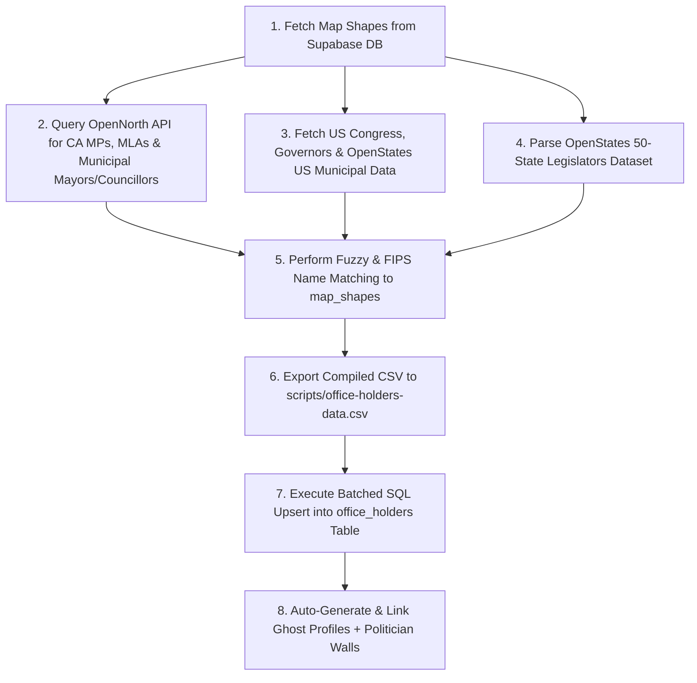

# Office Holders Data & Pipeline Documentation

This document explains where Choseno's active office holder data comes from, how the database pipeline works, and how to update or refresh representative data in the future.

---

## 1. Overview & Data Scope

Choseno maintains **10,661 active elected officials** across Canada and the United States, fully mapped to PostGIS electoral boundary shapes (`map_shapes`) and linked to dedicated **Politician Wall Profiles** (`/wall/[ghostId]/[slug]`).

### Breakdown by Geography & Tier

| Country | Jurisdiction / Chamber | Role Title | Active Holders |
| :--- | :--- | :--- | :---: |
| **Canada** | **Federal** (House of Commons) | Member of Parliament (MP) | **342** |
| **Canada** | **Provincial** (BC, AB, SK, MB, ON, QC, NB, NS, PEI, NL, YK, NWT) | MLA / MPP / MHA | **591** |
| **Canada** | **Municipal** (479 Cities / Towns / Municipalities) | Mayor / Maire | **359** |
| **Canada** | **Municipal** (City & Regional Councils across Canada) | Councillor / Conseiller | **2,249** |
| **USA** | **Federal** (House of Representatives) | U.S. Representative | **431** |
| **USA** | **State Executive** | Governor | **50** |
| **USA** | **State Federal** | U.S. Senator | **50** |
| **USA** | **State Senate** (Upper Chamber) | State Senator | **1,814** |
| **USA** | **State House** (Lower Chamber) | State Representative | **4,169** |
| **USA** | **Municipal** (571 Cities / Towns / Municipalities) | Mayor | **598** |
| **USA** | **Municipal** (City Councils & Boards of Aldermen) | Council Member | **8** |
| **TOTAL** | | | **10,661** |

---

## 2. Data Sources & Repositories

### Canadian Federal, Provincial & Municipal Office Holders & Civic Parties
- **Primary Data Provider**: [OpenNorth Represent API](https://represent.opennorth.ca/) (`https://represent.opennorth.ca/representatives/`)
- **Municipal Party Sources**: [CivicInfo BC](https://www.civicinfo.bc.ca/elections) (for all British Columbia municipalities) and Élections Québec / Wikipedia MediaWiki API (for Quebec municipalities like Montreal, Quebec City, Laval, Gatineau, Longueuil).
- **Coverage**: Canadian Members of Parliament (MPs), Provincial Legislators (MLAs, MPPs, MHAs), and Canadian Municipal Officials (Mayors, City Councillors, Regional Councillors, Reeves).
- **Extracted Fields**: Full Name, Municipality / District Name, Role Title (Mayor vs Councillor), Civic Party Affiliation (*Surrey Connect*, *Surrey First*, *Safe Surrey Coalition*, *ABC Vancouver*, *Projet Montréal*, etc.), Official Email, Phone, Government Source URL, Official Headshot Photo URL.

### US Federal Congress, State Governors & US Municipal Officials
- **Data Provider**: [unitedstates / congress-legislators](https://github.com/unitedstates/congress-legislators), [OpenStates Open-Data Repository](https://github.com/openstates/people) & Civil Services Executive Governors Dataset.
- **Coverage**: Active 119th Congress U.S. Senators, U.S. Representatives, State Governors, and US Municipal Officials (Mayors & City Council Members across 571 US cities).
- **Extracted Fields**: Full Name, State Code, District Number / City Name, Role Title (Mayor vs Council Member), Party Affiliation, Official Email, Phone, Office Address, Official Capitol / Municipal Photo URL.

### US State Senate & State House (All 50 States)
- **Data Provider**: [OpenStates Open-Data Repository](https://github.com/openstates/people)
- **Coverage**: 50 State Senates (Upper Chambers) and 50 State Houses (Lower Chambers).
- **Extracted Fields**: Official Name, Chamber Title, District Name/Number, Photo URL, Contact Email, Capitol Phone, Party Affiliation.

---

## 3. How the Pipeline & Current Office Holder Detection Work

The end-to-end data pipelines are located at:
- National / State / Federal Pipeline: [`scripts/populate-all-office-holders.py`](file:///Users/vmn2k4/Coding/Choseno/scripts/populate-all-office-holders.py)
- BC & Quebec Municipal Civic Party Pipeline: [`scripts/fast-populate-bc-qc.py`](file:///Users/vmn2k4/Coding/Choseno/scripts/fast-populate-bc-qc.py)
- Canadian Municipal Pipeline: [`scripts/populate-canadian-municipal.py`](file:///Users/vmn2k4/Coding/Choseno/scripts/populate-canadian-municipal.py)
- US Municipal Pipeline: [`scripts/populate-us-municipal.py`](file:///Users/vmn2k4/Coding/Choseno/scripts/populate-us-municipal.py)

### Current Office Holder Detection (Politician Wall & UI)
Current office holders are detected dynamically via `enrichProfileWithContactFallback()` in [`src/lib/services/politicianWall.ts`](file:///Users/vmn2k4/Coding/Choseno/src/lib/services/politicianWall.ts):
- Checks for corresponding entries in `public.office_holders` (via `linked_profile_id` or matching full name) and `holding_since`.
- Active office holders display their official role badge directly (e.g. **`[MAYOR]`**, **`[COUNCILLOR]`**, **`[GOVERNOR]`**, **`[MP]`**).
- Non-office holder candidates aspiring for office display **`[ASPIRING MAYOR]`**, **`[ASPIRING COUNCILLOR]`**, etc.

### Pipeline Execution Flow



1. **Boundary Matching**: Queries `map_shapes` in PostgreSQL to build high-performance lookup dictionaries matching shape names, FIPS codes, and riding/city titles.
2. **Data Aggregation**: Merges data from OpenNorth, Congress-Legislators, and OpenStates into a unified schema.
3. **CSV Export**: Writes a clean, standardized 10,661-row export file:
   [`scripts/office-holders-data.csv`](file:///Users/vmn2k4/Coding/Choseno/scripts/office-holders-data.csv)
4. **Database Upsert**: Executes batched SQL statements into the `office_holders` Supabase table.
5. **Politician Wall Sync**: Auto-generates a `profiles` record (`role: 'politician'`, `current_ghost_id`) and `politician_profiles` entry for every office holder so that clicking any representative opens their official **Politician Wall** (`/wall/[ghostId]/[slug]`).

---

## 4. How to Update Data in the Future

### Option A: Re-Run Automated Ingestion Pipelines (Recommended)

When municipal, state, or federal elections occur, re-run the python pipeline scripts:

```bash
# Update Federal, Provincial, US Congress, Governors, State Legislatures
python3 scripts/populate-all-office-holders.py

# Update Canadian Municipal Mayors & Councillors across all cities
python3 scripts/populate-canadian-municipal.py

# Update US Municipal Mayors & Council Members across all US cities
python3 scripts/populate-us-municipal.py
```

This script automatically:
1. Re-fetches the latest official data.
2. Regenerates [`scripts/office-holders-data.csv`](file:///Users/vmn2k4/Coding/Choseno/scripts/office-holders-data.csv).
3. Updates the `office_holders` table in Supabase.
4. Ensures all Politician Wall profiles remain in sync.

---

### Option B: Manual CSV Edit & Import

To manually update specific office holders, contact emails, photo URLs, or party affiliations:

1. Open [`scripts/office-holders-data.csv`](file:///Users/vmn2k4/Coding/Choseno/scripts/office-holders-data.csv) in a text editor or spreadsheet app.
2. Edit or add rows using the CSV columns:
   `map_shape_id, role_title, full_name, political_party, bio, contact_email, contact_phone, holding_since, source_url, photo_url`
3. Run the CSV import script to push your changes to Supabase:
   ```bash
   node scripts/import-to-db.js
   ```

---

### Option C: Admin Web UI Dashboard

Admins can also add, edit, or delete individual office holders interactively without running terminal scripts:

1. Log in as an Admin on Choseno.
2. Navigate to `/admin/office-holders`.
3. Select any Country, Boundary Type, and District Shape to update or reassign office holders on the fly.

---

## 5. Related Files & Artifacts

- **Data File**: [`scripts/office-holders-data.csv`](file:///Users/vmn2k4/Coding/Choseno/scripts/office-holders-data.csv)
- **US Municipal Ingestion Pipeline**: [`scripts/populate-us-municipal.py`](file:///Users/vmn2k4/Coding/Choseno/scripts/populate-us-municipal.py)
- **Canadian Municipal Ingestion Pipeline**: [`scripts/populate-canadian-municipal.py`](file:///Users/vmn2k4/Coding/Choseno/scripts/populate-canadian-municipal.py)
- **National / State Ingestion Pipeline**: [`scripts/populate-all-office-holders.py`](file:///Users/vmn2k4/Coding/Choseno/scripts/populate-all-office-holders.py)
- **Node CSV Importer**: [`scripts/import-to-db.js`](file:///Users/vmn2k4/Coding/Choseno/scripts/import-to-db.js)
- **Elections & Office Holders Service**: [`src/lib/services/elections.ts`](file:///Users/vmn2k4/Coding/Choseno/src/lib/services/elections.ts)
- **Politician Sidebar Component**: [`src/components/features/PoliticianSidebar.tsx`](file:///Users/vmn2k4/Coding/Choseno/src/components/features/PoliticianSidebar.tsx)
- **Boundary Directory Page**: [`src/app/elections/[boundarySlug]/page.tsx`](file:///Users/vmn2k4/Coding/Choseno/src/app/elections/[boundarySlug]/page.tsx)
