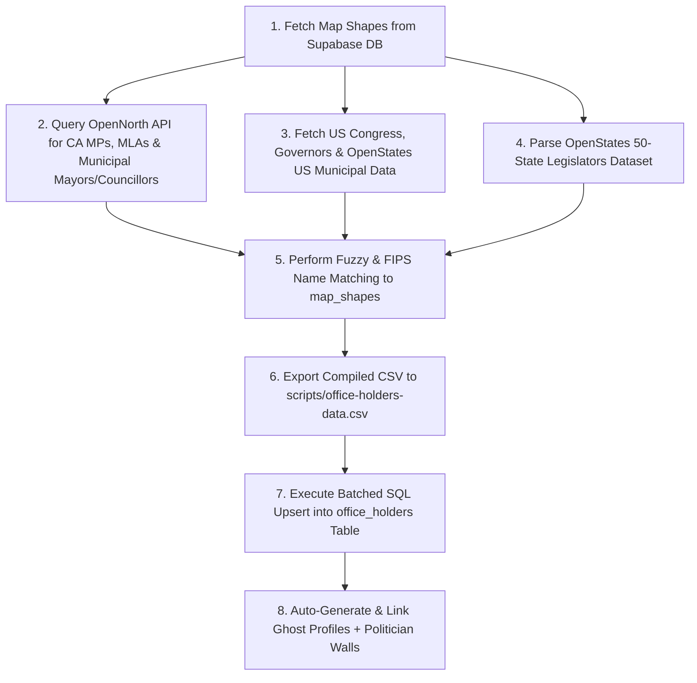

# Office Holders Data & Pipeline Documentation

This document explains where Choseno's active office holder data comes from, how the database pipeline works, and how to update or refresh representative data in the future.

---

## 1. Overview & Data Scope

Choseno maintains **11,208 currently-serving elected officials** (`is_current = true`) across Canada and the United States, fully mapped to PostGIS electoral boundary shapes (`map_shapes`) and linked to dedicated **Politician Wall Profiles** (`/wall/[ghostId]/[slug]`). Anyone who has left office is retired, not deleted — see the term-lifecycle note in section 3. Counts below refreshed 2026-08-17 after the BC re-sync described in section 2.

### Breakdown by Geography & Tier

| Country | Jurisdiction / Chamber | Role Title | Active Holders |
| :--- | :--- | :--- | :---: |
| **Canada** | **Federal** (House of Commons) | Member of Parliament (MP) | **342** |
| **Canada** | **Provincial** (BC, AB, SK, MB, ON, QC, NB, NS, PEI, NL, YK, NWT) | MLA / MPP / MHA | **591** |
| **Canada** | **Municipal** (Cities / Towns / Municipalities) | Mayor / Maire | **372** |
| **Canada** | **Municipal** (City & Regional Councils across Canada) | Councillor / Conseiller | **2,379** |
| **Canada** | **School District** (BC — 60 districts) | School Trustee | **352** |
| **Canada** | **School District** (BC — 60 districts) | Board Chair | **52** |
| **USA** | **Federal** (House of Representatives) | U.S. Representative | **431** |
| **USA** | **State Executive** | Governor | **50** |
| **USA** | **State Federal** | U.S. Senator | **50** |
| **USA** | **State Senate** (Upper Chamber) | State Senator | **1,814** |
| **USA** | **State House** (Lower Chamber) | State Representative | **4,169** |
| **USA** | **Municipal** (571 Cities / Towns / Municipalities) | Mayor | **598** |
| **USA** | **Municipal** (City Councils & Boards of Aldermen) | Council Member | **8** |
| **TOTAL** | | | **11,208** |

---

## 2. Data Sources & Repositories

### ⚠️ Matching principle: never resolve a boundary by name alone

**A bare place name is not a unique key — it must always be scoped by its containing province/state (or matched by an authoritative code) before it's used to pick a `map_shapes` row.** Place names collide across provinces/states constantly and this is not a rare edge case: as of this writing, `map_shapes` has **204 Canadian municipality names that repeat across more than one province** (Victoria: BC, Manitoba, Newfoundland and Labrador, PEI; Woodstock: New Brunswick, Newfoundland and Labrador, Ontario; Richmond, Hope, Armstrong, Mackenzie, Stratford, Shelburne, and dozens more). The same class of collision exists for USA municipalities across states and India wards across cities (though most of *those* are legitimate — "Ward 1" existing once per city nationwide is normal, not a bug; see the India note further down for how to tell a real collision from a coincidental name match).

**This was not theoretical — it corrupted real data.** [`scripts/sync-bc-election-results.py`](scripts/sync-bc-election-results.py) originally matched CivicInfo BC's winners against `map_shapes` filtered only by `country = 'Canada'`, with no province scoping at all. It silently wrote real BC officeholders onto other provinces' identically-named shapes: BC's Hope → Quebec's "Hope", BC's Richmond → Quebec's "Richmond", BC's Armstrong → Manitoba's "Armstrong", and — via a normalization rule that strips a trailing "County" suffix — BC's Mackenzie → Alberta's "Mackenzie County" entirely. 30 real people ended up with Politician Wall profiles tagged to the wrong province before this was caught and fixed on 2026-08-17 (cleanup: retire/delete the wrong-shape rows, since they represent a placement error rather than a real person leaving a real office — do not run them through the `is_current`/`term_ended_at` retirement flow meant for actual term transitions).

**The fix, and the pattern every pipeline should follow, in priority order:**
1. **Match by an authoritative code when one exists**, not a name at all. For Canadian municipalities, `map_shapes.code` is a StatCan census-subdivision code whose first two digits *are* the province — and OpenNorth's `related.boundary_url` (`/boundaries/census-subdivisions/<code>/`) carries that exact code for roughly half of municipal reps. Code-to-code matching sidesteps name collisions entirely rather than working around them.
2. **When only a name is available, scope the candidate set by the containing province/state first** (via `shape_containers`, joined to a `boundary_type = 'Province'` row), then match the name only within that scope. `scripts/sync-bc-election-results.py` and `scripts/sync-nb-election-results.py` both do this now — their `map_shapes` queries join through `shape_containers` to the specific province by name before any name-normalization happens.
3. **Never fall back to an unscoped, ambiguous name match.** If a name can't be resolved by code or by province and multiple shapes nationwide share that normalized name, leave it unmatched and print it (per the "no silent caps" principle below) rather than guessing — a wrong silent match is worse than a visible gap. An unscoped fallback is only acceptable when the name is verified unambiguous nationally (exactly one shape has it).

`scripts/populate-canadian-municipal.py` (OpenNorth, covering the 8 provinces without their own dedicated pipeline yet — see below) had the identical unscoped-matching flaw and was fixed on 2026-08-17 to follow this same three-tier approach (CSD code → province-scoped name → unambiguous-name-only fallback). Its *historical* output — the officeholder data already live from before this fix, ingested under the old unscoped logic — has **not** been fully re-audited province by province the way BC and NB now have; a spot-check of several known collision names (Victoria, Woodstock, Stratford, Burlington, Shelburne, Armstrong) found no evidence of scattered data for those specific cases, but that is not a guarantee across all 204 colliding names, only a reassuring sample. Treat non-BC/non-NB municipal data with that caveat until it's been through the same re-verification BC and NB got.

### Canadian Federal & Provincial Office Holders
- **Primary Data Provider**: [OpenNorth Represent API](https://represent.opennorth.ca/) (`https://represent.opennorth.ca/representatives/`)
- **Coverage**: Canadian Members of Parliament (MPs) and Provincial Legislators (MLAs, MPPs, MHAs).
- **Extracted Fields**: Full Name, Riding/District Name, Role Title, Party Affiliation, Official Email, Phone, Government Source URL, Official Headshot Photo URL.
- **Known limitation**: OpenNorth's data for non-BC/non-NB municipal seats is sourced the same way and is used for the rest of Canada's municipal officials (below), but has not been independently verified province-by-province the way BC and NB have (see below) — treat those rows with the same skepticism until an equivalent authoritative per-province source is found and validated.

### New Brunswick Municipal Office Holders
- **Primary Data Provider**: [Elections NB's official May 2026 municipal election publications](https://electionsnb.ca/content/enb/en/results-reports-publications.html) — the "Lists of Candidates" PDF (nominees, with acclaimed winners marked `(accl.)`) cross-referenced against the "Results (Tab)" XLSX (per-poll vote totals with a `Total` row per candidate) — **not** the OpenNorth Represent API.
- **Why**: NB held a general local election May 11, 2026. Our previous ~592 "current" NB rows (OpenNorth-sourced) predated it. Worse, NB's entire municipal boundary dataset (`map_shapes`) turned out to be frozen at the 2021 Census — before NB's Jan 1, 2023 local governance reform that collapsed ~340 legacy entities into 89 new ones (77 local governments + 12 rural districts) — so even a perfect officeholder feed had nothing correct to attach to for a third of the new municipalities, and attached ambiguously for another third (two different pre-reform entities sharing one post-reform name, e.g. old Moncton city + old Moncton parish).
- **Boundary fix required first**: [`scripts/import-nb-local-governments-2023.py`](scripts/import-nb-local-governments-2023.py) imports [GeoNB's official "Local Governments" dataset](https://gnb.socrata.com/GeoNB/Local-Governments-Gouvernements-locaux/sqh9-kfnn) (77 shapes, effective 2023-01-01) and retires the 271 obsolete pre-reform `map_shapes` rows it replaces (`retired_at`, never deleted — `trg_reconcile_shape_containers` handles `shape_containers` cleanup automatically on retirement, don't insert into `shape_containers` manually, it races that trigger). Rural districts (a different category — they elect advisory committees, not a mayor/council) are **not** imported; `office_holders` has no role for them yet.
- **Coverage**: NB local government mayors & councillors only (not rural district advisory committees, not district education councils — different election categories entirely, in separate PDF sections).
- **Pipeline**: [`scripts/sync-nb-election-results.py`](scripts/sync-nb-election-results.py) `--apply`. Run the boundary import above first, or every municipality created by the 2023 reform will be reported unmatched.
- **Known gaps**: ~2 of ~73 municipalities (Grand Falls' bilingual North/South ward-naming) don't parse cleanly out of the candidates PDF's 3-column layout — printed as unresolved by the script, not silently dropped, rather than chasing every PDF layout edge case.
- **Refresh cadence**: tied to NB's local election schedule (next expected ~2030 per the reform's cycle; check electionsnb.ca for by-elections in between).

### India Municipal Wards — Known Boundary Duplication (Tamil Nadu, fixed 2026-08-17)
`map_shapes` for India Wards has four separate uploads, not one — a nationwide "Swachh Bharat Mission" set (63,674 wards) and a supplementary "Tamil Nadu Municipal Wards (LivingAtlas/Esri)" set (737 wards, 10 cities) that turned out to genuinely overlap the nationwide set for exactly 3 of those 10 cities (Chennai, Coimbatore, Erode — confirmed via matching `ulbname`, not by upload recency, since the nationwide set is both older *and* the better-quality one here: proper `ulbcode`, an explicit `APPROVED` status, and a ward count that matches the known-correct figure for Chennai). The other 7 LivingAtlas cities (Chengalpattu, Dindigul, Hosur, Kanchipuram, Karur, Madurai, Thanjavur) have **no** nationwide coverage at all — LivingAtlas is the only source for them, so the fix retires only the 3 truly-overlapping cities' LivingAtlas rows ([`scripts/fix-tamil-nadu-ward-duplicates.sql`](scripts/fix-tamil-nadu-ward-duplicates.sql)), not the whole upload. **This is not the only duplication in `map_shapes`** — a full audit (`GROUP BY country, boundary_type, name HAVING count(*) > 1`) turns up large numbers of same-named rows elsewhere (USA Municipal, India Ward broadly, Canada Advance Polling District, ...), but most of those are legitimate distinct places that happen to share a plain name across different states/cities (e.g. "Ward 1" exists once per city nationwide, "Franklin" is a real town name in a dozen US states) — false positives from a name-only grouping, not bugs. Distinguishing a real duplicate from a coincidental name match requires checking upload provenance and geographic/administrative scope per case, the way this fix and the NB boundary fix above both did; don't retire on a bare name-collision count alone.

### British Columbia Municipal & School Trustee Office Holders
- **Primary Data Provider**: [CivicInfo BC's official general local election results](https://www.civicinfo.bc.ca/electionreports/candidates-and-results.php) (`candidates-and-results.php?year=<YEAR>`, filtered to `is_winner == 'YES'`) — **not** the OpenNorth Represent API, and **not** CivicInfo's own "current representatives" listing that OpenNorth mirrors.
- **Why**: verified directly against Maple Ridge on 2026-08-17 — OpenNorth's API (and the CivicInfo feed it mirrors) still returned Mike Morden as mayor and the outgoing 2018–2022 council long after the Oct 2022 election. The election-results feed, by contrast, matched Maple Ridge's own "Meet Your Council" page and SD42's own "Board of Education" page exactly, for every mayor, councillor, and school trustee. See [20260816000000_office_holder_term_lifecycle.sql](supabase/migrations/20260816000000_office_holder_term_lifecycle.sql) for the full trace.
- **Coverage**: BC municipal mayors & councillors (City/District/Town/Village/Township/Regional Municipality/Island Municipality/Resort Municipality), **plus BC school district trustees & board chairs** — a category the OpenNorth pipeline never covered anywhere in Canada.
- **Chair caveat**: school board chair is not itself an elected position — trustees elect their own chair after being sworn in, so it can't be read off the ballot. `CHAIR_OVERRIDES` in the sync script is a small, manually-curated map that still needs periodic reverification per district (e.g. against that district's own "Board of Education" page); the script only guards against assigning chair to someone who isn't even a winning trustee that cycle.
- **Refresh cadence**: tied to BC's fixed general local election schedule (every 4 years — next is Oct 2026). Re-run with `--year 2026` once CivicInfo publishes certified results; there's no reason to run it more often than that for this feed.
- **Pipeline**: [`scripts/sync-bc-election-results.py`](scripts/sync-bc-election-results.py) `--year <YEAR> --apply`. Supersedes `fast-populate-bc-qc.py`, `populate-bc-qc-parties.py` (literal duplicates of each other, both from commit 807261d, never deduplicated — used this same CivicInfo feed but only to patch `political_party_id` on rows a different, unreliable pipeline had already created), and `populate-bc-school-trustees.py` (a hardcoded, frozen snapshot with no `source_url` and no freshness tracking at all).
- **Known gaps**: 41 winners (out of ~1,436 parsed) could not be matched to a `map_shapes` row — mostly renamed/regional entities (e.g. "Daajing Giids", formerly Queen Charlotte) or provice-wide bodies without a single geographic boundary (Conseil Scolaire Francophone) — printed by the script, not silently dropped. Separately, `map_shapes` has duplicate `code` values for at least 25 BC school districts (e.g. id 132034 is correctly "SD42 - Maple Ridge-Pitt Meadows", but a second row, id 132257, is named "Border Land" yet also carries `code = '42'`) — a pre-existing boundary-data bug, unrelated to officeholder freshness; the sync script matches by name specifically to avoid tripping over it, but the duplicate rows themselves are still there.

### Quebec Municipal Party Affiliation & Other Canadian Municipal Officials
- **Municipal Party Source**: Élections Québec / Wikipedia MediaWiki API (for Quebec municipalities like Montreal, Quebec City, Laval, Gatineau, Longueuil).
- **Coverage (outside BC)**: Canadian Municipal Officials (Mayors, City Councillors, Regional Councillors, Reeves) via the OpenNorth Represent API — see the known limitation above.
- **Extracted Fields**: Full Name, Municipality / District Name, Role Title (Mayor vs Councillor), Civic Party Affiliation (*Surrey Connect*, *Surrey First*, *Safe Surrey Coalition*, *ABC Vancouver*, *Projet Montréal*, etc.), Official Email, Phone, Government Source URL, Official Headshot Photo URL.

### US Federal Congress, State Governors & US Municipal Officials
- **Data Provider**: [unitedstates / congress-legislators](https://github.com/unitedstates/congress-legislators), [OpenStates Open-Data Repository](https://github.com/openstates/people) & Civil Services Executive Governors Dataset.
- **Coverage**: Active 119th Congress U.S. Senators, U.S. Representatives, State Governors, and US Municipal Officials (Mayors & City Council Members across 571 US cities).
- **Extracted Fields**: Full Name, State Code, District Number / City Name, Role Title (Mayor vs Council Member), Party Affiliation, Official Email, Phone, Office Address, Official Capitol / Municipal Photo URL.

### US State Senate & State House (All 50 States)
- **Data Provider**: [OpenStates Open-Data Repository](https://github.com/openstates/people)
- **Coverage**: 50 State Senates (Upper Chambers) and 50 State Houses (Lower Chambers).
- **Extracted Fields**: Official Name, Chamber Title, District Name/Number, Photo URL, Contact Email, Capitol Phone, Party Affiliation.

---

## 3. How the Pipeline & Current Office Holder Detection Work

The end-to-end data pipelines are located at:
- National / State / Federal Pipeline: [`scripts/populate-all-office-holders.py`](file:///Users/vmn2k4/Coding/Choseno/scripts/populate-all-office-holders.py)
- **BC Municipal & School Trustee Pipeline (primary source of truth for BC)**: [`scripts/sync-bc-election-results.py`](file:///Users/vmn2k4/Coding/Choseno/scripts/sync-bc-election-results.py)
- **NB Municipal Pipeline (primary source of truth for New Brunswick)**: [`scripts/sync-nb-election-results.py`](file:///Users/vmn2k4/Coding/Choseno/scripts/sync-nb-election-results.py) — run [`scripts/import-nb-local-governments-2023.py`](file:///Users/vmn2k4/Coding/Choseno/scripts/import-nb-local-governments-2023.py) first if NB's boundaries need re-checking against a newer GeoNB release
- Canadian Municipal Pipeline (rest of Canada, via OpenNorth — see the known limitation in section 2): [`scripts/populate-canadian-municipal.py`](file:///Users/vmn2k4/Coding/Choseno/scripts/populate-canadian-municipal.py)
- US Municipal Pipeline: [`scripts/populate-us-municipal.py`](file:///Users/vmn2k4/Coding/Choseno/scripts/populate-us-municipal.py)

### Current / Former / Aspiring Office Holder Detection (Politician Wall & UI)
`public.office_holders` rows are never deleted or overwritten when someone leaves office — they're retired in place (`is_current = false`, `term_ended_at` set) so term history and any wall claim survive; see [20260816000000_office_holder_term_lifecycle.sql](file:///Users/vmn2k4/Coding/Choseno/supabase/migrations/20260816000000_office_holder_term_lifecycle.sql). Detected dynamically via `enrichProfileWithContactFallback()` in [`src/lib/services/politicianWall.ts`](file:///Users/vmn2k4/Coding/Choseno/src/lib/services/politicianWall.ts):
- Checks for corresponding entries in `public.office_holders` (via `linked_profile_id` or matching full name), filtered to `is_current`.
- Current office holders display their official role badge directly (e.g. **`[MAYOR]`**, **`[COUNCILLOR]`**, **`[GOVERNOR]`**, **`[MP]`**).
- A retired officeholder (`is_current = false`) displays **`[FORMER MAYOR]`**, etc., instead — never silently reverts to looking like an active/aspiring candidate.
- Non-office holder candidates aspiring for office display **`[ASPIRING MAYOR]`**, **`[ASPIRING COUNCILLOR]`**, etc.

### Pipeline Execution Flow



1. **Boundary Matching**: Queries `map_shapes` in PostgreSQL to build high-performance lookup dictionaries matching shape names, FIPS codes, and riding/city titles.
2. **Data Aggregation**: Merges data from OpenNorth, Congress-Legislators, and OpenStates into a unified schema.
3. **CSV Export**: Writes a clean, standardized 10,661-row export file:
   [`scripts/office-holders-data.csv`](file:///Users/vmn2k4/Coding/Choseno/scripts/office-holders-data.csv)
4. **Database Upsert**: Executes batched SQL statements into the `office_holders` Supabase table.
5. **Politician Wall Sync**: Auto-generates a `profiles` record (`role: 'politician'`, `current_ghost_id`) and `politician_profiles` entry for every office holder so that clicking any representative opens their official **Politician Wall** (`/wall/[ghostId]/[slug]`).

---

## 4. How to Update Data in the Future

### Option A: Re-Run Automated Ingestion Pipelines (Recommended)

When municipal, state, or federal elections occur, re-run the python pipeline scripts:

```bash
# Update Federal, Provincial, US Congress, Governors, State Legislatures
python3 scripts/populate-all-office-holders.py

# Update BC Municipal Mayors/Councillors + School Trustees (after a BC
# general local election, e.g. Oct 2026 -- once CivicInfo publishes
# certified results, pass that year)
python3 scripts/sync-bc-election-results.py --year 2026 --apply

# Update Canadian Municipal Mayors & Councillors outside BC
python3 scripts/populate-canadian-municipal.py

# Update US Municipal Mayors & Council Members across all US cities
python3 scripts/populate-us-municipal.py
```

These scripts automatically:
1. Re-fetch the latest official data.
2. Retire anyone no longer returned as a current winner (`is_current = false`, `term_ended_at` set) instead of leaving them looking current, or overwriting their row.
3. Update the `office_holders` table in Supabase.
4. Ensure all Politician Wall profiles remain in sync.

`sync-bc-election-results.py` defaults to a dry run — it fetches, parses, and writes the generated SQL to `scripts/bc-election-results-sync.sql` for review, but only executes it against the database when `--apply` is passed.

---

### Option B: Manual CSV Edit & Import

To manually update specific office holders, contact emails, photo URLs, or party affiliations:

1. Open [`scripts/office-holders-data.csv`](file:///Users/vmn2k4/Coding/Choseno/scripts/office-holders-data.csv) in a text editor or spreadsheet app.
2. Edit or add rows using the CSV columns:
   `map_shape_id, role_title, full_name, political_party, bio, contact_email, contact_phone, holding_since, source_url, photo_url`
3. Run the CSV import script to push your changes to Supabase:
   ```bash
   node scripts/import-to-db.js
   ```

---

### Option C: Admin Web UI Dashboard

Admins can also add, edit, or delete individual office holders interactively without running terminal scripts:

1. Log in as an Admin on Choseno.
2. Navigate to `/admin/office-holders`.
3. Select any Country, Boundary Type, and District Shape to update or reassign office holders on the fly.

---

## 5. Related Files & Artifacts

- **Data File**: [`scripts/office-holders-data.csv`](file:///Users/vmn2k4/Coding/Choseno/scripts/office-holders-data.csv) (national/state/US-municipal pipelines only; the BC pipeline writes directly to Supabase, see below)
- **BC Municipal & School Trustee Pipeline**: [`scripts/sync-bc-election-results.py`](file:///Users/vmn2k4/Coding/Choseno/scripts/sync-bc-election-results.py) (generates [`scripts/bc-election-results-sync.sql`](file:///Users/vmn2k4/Coding/Choseno/scripts/bc-election-results-sync.sql) for review before `--apply`)
- **US Municipal Ingestion Pipeline**: [`scripts/populate-us-municipal.py`](file:///Users/vmn2k4/Coding/Choseno/scripts/populate-us-municipal.py)
- **Canadian Municipal Ingestion Pipeline (outside BC)**: [`scripts/populate-canadian-municipal.py`](file:///Users/vmn2k4/Coding/Choseno/scripts/populate-canadian-municipal.py)
- **National / State Ingestion Pipeline**: [`scripts/populate-all-office-holders.py`](file:///Users/vmn2k4/Coding/Choseno/scripts/populate-all-office-holders.py)
- **Node CSV Importer**: [`scripts/import-to-db.js`](file:///Users/vmn2k4/Coding/Choseno/scripts/import-to-db.js)
- **Term Lifecycle Migration**: [`supabase/migrations/20260816000000_office_holder_term_lifecycle.sql`](file:///Users/vmn2k4/Coding/Choseno/supabase/migrations/20260816000000_office_holder_term_lifecycle.sql)
- **Elections & Office Holders Service**: [`src/lib/services/elections.ts`](file:///Users/vmn2k4/Coding/Choseno/src/lib/services/elections.ts)
- **Politician Sidebar Component**: [`src/components/features/PoliticianSidebar.tsx`](file:///Users/vmn2k4/Coding/Choseno/src/components/features/PoliticianSidebar.tsx)
- **Boundary Directory Page**: [`src/app/elections/[boundarySlug]/page.tsx`](file:///Users/vmn2k4/Coding/Choseno/src/app/elections/[boundarySlug]/page.tsx)
