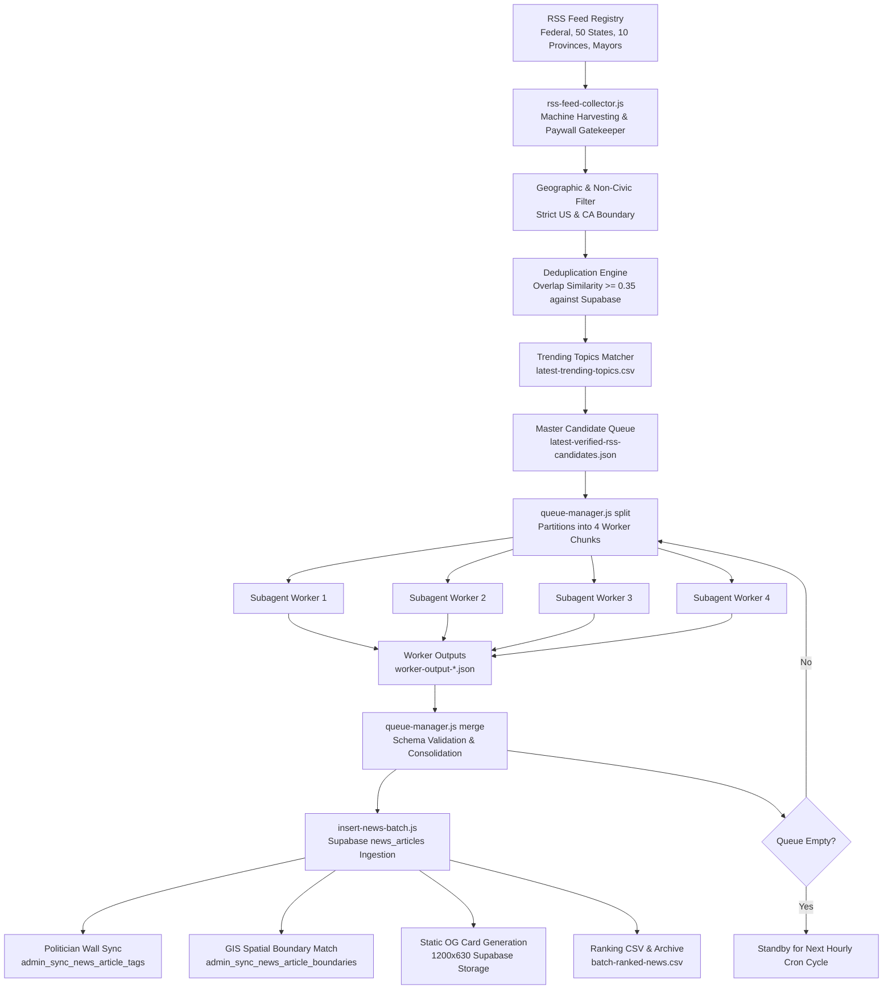

# Choseno Autonomous Newsroom Pipeline: Comprehensive Architecture & Operations

## 1. Executive Summary & Design Principles

The Choseno Newsroom Pipeline is a production-grade, autonomous civic intelligence system. It discovers, verifies, deduplicates, synthesizes, and publishes state, provincial, and municipal news across the **United States and Canada**.

### Core Architecture Principles

1. **Strict Machine vs. LLM Division of Labor**:
   - **Machine Scripts** (`rss-verified-pipeline.js`, `rss-feed-collector.js`, `queue-manager.js`, `insert-news-batch.js`): Control 100% of candidate discovery, HTTP status checks, paywall gating, geographic filtering, database deduplication, queue partitioning, and Supabase ingestion.
   - **Antigravity AI Subagents**: Dedicated exclusively to search-grounded journalistic synthesis, transforming raw verified event leads into 500–750 word, neutral, non-partisan civic reports adhering to the schema.
2. **Strict Geographic Mandate**:
   - 100% of stories are geographically bound to the United States (all 50 states + DC/territories) and Canada (all 10 provinces + 3 territories). Non-US/CA international wires and non-civic celebrity gossip are filtered at the ingestion boundary.
3. **Zero-Hallucination Grounding**:
   - Every synthesized report is verified against live primary sources (government dockets, legislative transcripts, court filings, official press conferences, and regional news wires).
4. **Autonomous Continuous Drain Loop**:
   - The pipeline operates on an unbroken loop: candidate queues are partitioned into parallel subagent worker chunks and continuously synthesized until the queue count reaches zero.

---

## 2. End-to-End Pipeline Data Flow



---

## 3. Detailed Component Breakdown

### Stage 1: Feed Harvesting & Ingestion (`scripts/rss-feed-collector.js`)

- **Feed Registry**:
  - **National & Federal Wires**: *The Hill, Politico Congress, CBC News Politics, The Globe and Mail, Global News*.
  - **Key Leader Targeted Feeds**: Real-time Google News RSS monitors for key US & Canadian leaders (*e.g., Donald Trump, JD Vance, Hakeem Jeffries, Gavin Newsom, Doug Ford, Danielle Smith, David Eby, Wab Kinew*).
  - **50 US State Capitols & Municipal Feeds**: Dedicated RSS queries for state legislatures, city councils, mayors, county commissions, and school boards.
  - **13 Canadian Provincial & Municipal Feeds**: Dedicated provincial legislature, city hall, and civic politics feeds.
- **Lookback Window Calculation (`scripts/get-last-publish-window.js`)**:
  - Automatically queries the Supabase database for the timestamp of the most recently published article.
  - Slices the lookback window to fetch all stories since the last publication (with a safety cap between 1h and 24h).
- **HTTP Status & Paywall Gatekeeper**:
  - **Tier-1 (Full Text)**: Scrapes full article body text and metadata when accessible.
  - **Tier-2 (Allowlisted Paywalled)**: Detects HTTP 401/403 on trusted allowlist domains (*WSJ, Bloomberg, NYT, Washington Post, Globe and Mail, Toronto Star*). Permits summary extraction while strictly prohibiting unverified direct quotes.
  - **Tier-3 (Rejection)**: Hard drops 404, 410, timeouts, and non-article root/landing pages.

---

### Stage 2: Deduplication Engine & Overlap Similarity

The pipeline enforces multi-layer deduplication at both the collector stage and the queue partitioning stage.

#### Mathematical Overlap Scoring Formula

To catch rewrites, wire syndications, and editorial variations of the same underlying story, the system calculates token-set overlap similarity:

$$\text{Overlap Similarity}(S_1, S_2) = \frac{|W_1 \cap W_2|}{\min(|W_1|, |W_2|)}$$

Where:
- $W_1 = \text{Set of normalized word tokens in String } 1 \text{ (length } > 2\text{, alphanumeric only)}$
- $W_2 = \text{Set of normalized word tokens in String } 2$

```javascript
function getWords(str) {
  return new Set((str || '').toLowerCase().replace(/[^a-z0-9]/g, ' ').split(/\s+/).filter(w => w.length > 2));
}

function overlapSimilarity(s1, s2) {
  const w1 = getWords(s1);
  const w2 = getWords(s2);
  if (w1.size === 0 || w2.size === 0) return 0;
  let inter = 0;
  for (const w of w1) if (w2.has(w)) inter++;
  return inter / Math.min(w1.size, w2.size);
}
```

#### Deduplication Rules

1. **Database Historical Deduplication**:
   - Every candidate headline is checked against the last 1,000 published articles in Supabase.
   - If $\text{overlapSimilarity}(\text{Candidate Title}, \text{DB Headline}) \ge 0.35$ OR $\text{overlapSimilarity}(\text{Candidate Title}, \text{DB Slug}) \ge 0.35$, the story is dropped as already published.
2. **In-Batch Deduplication**:
   - Within the same RSS harvest, identical or high-overlap headlines across competing syndication networks (*e.g., AP vs. local affiliate*) are merged, keeping the highest-quality source.

---

### Stage 3: Queue Management (`scripts/queue-manager.js`)

`queue-manager.js` coordinates state between the machine pipeline, the filesystem, and the AI synthesis workers.

1. **`node scripts/queue-manager.js split <numWorkers> <chunkSize>`**:
   - Queries Supabase for live records to verify freshness.
   - Prunes any already-published candidates from `scripts/latest-verified-rss-candidates.json`.
   - Slices the remaining backlog into equal chunks (e.g., 4 workers $\times$ 5 stories = 20 items per wave).
   - Writes `scripts/worker-chunk-1.json` through `scripts/worker-chunk-N.json`.
   - Returns a structured payload with remaining queue counts.
2. **`node scripts/queue-manager.js merge`**:
   - Discovers all `scripts/worker-output-*.json` files.
   - Validates JSON structure and consolidates all articles into `scripts/bulk-news-batch.json`.
   - Invokes `scripts/insert-news-batch.js` to execute Supabase ingestion.
   - Prunes synthesized items from `latest-verified-rss-candidates.json`.
   - Cleans up temporary chunk and output files.

---

### Stage 4: Multi-Subagent Parallel Synthesis Engine

The synthesis phase leverages parallel subagents working concurrently.

#### Subagent Execution Contract

Each worker:
1. Reads its assigned chunk (`scripts/worker-chunk-X.json`).
2. Conducts web search grounding to gather official dates, vote tallies, quotes, docket numbers, and context.
3. Formats each article according to the **Choseno Article Schema**:
   - `slug`: Kebab-case URL slug with date (*e.g., `federal-appeals-court-rejects-lamonica-mciver-immunity-bid-2026-08-30`*).
   - `headline`: Factual, active-voice title.
   - `summary`: Exactly 2 sentences of neutral, high-density summary.
   - `category`: `Politics`, `Municipal`, `Elections`, `Economy`, or `Public Safety`.
   - `country`: `US` or `CA`.
   - `province`: Two-letter state/province abbreviation (*e.g., `CA`, `TX`, `ON`, `BC`, `NJ`*).
   - `impactArea`: `national`, `state`, `province`, or `municipal`.
   - `latitude` / `longitude`: Exact geographic coordinates of the municipal city hall or state capitol.
   - `eventDate`: `YYYY-MM-DD` of the actual event.
   - `tags`: Array of relevant topical and entity tags.
   - `taggedPoliticians`: Array of full names of elected officials featured in the story.
   - `author`: `{ name: "Choseno Civic News Desk", bio: "Civic and political reporting" }`.
   - `seoTitle`: Title optimized for search engines ($\le 60$ characters).
   - `metaDescription`: Meta description ($\le 160$ characters).
   - `tweet`: Single-sentence social post ($\le 280$ characters).
   - `sources`: Array of source objects `[{ name, url }]`.
   - `body`: Multi-paragraph continuous non-partisan prose (**strictly 500–750 words**).
4. Writes output to `scripts/worker-output-X.json` and signals completion.

---

### Stage 5: Database Ingestion & Relational Propagation (`scripts/insert-news-batch.js`)

When `insert-news-batch.js` executes, it performs relational and spatial operations:

1. **Slug Deduplication**:
   - Performs a pre-flight check against the latest 1,000 slugs in Supabase to guarantee uniqueness.
2. **Profile & Politician Wall Sync**:
   - Resolves all names in `taggedPoliticians` against 31,000+ cached politician profiles in Supabase.
   - Calls the database RPC `admin_sync_news_article_tags(article_id, politician_ids)`.
   - Automatically posts mirrored updates onto the politician's activity wall (`/wall/[slug]`).
3. **GIS Boundary Synchronization**:
   - Calls database RPC `admin_sync_news_article_boundaries(article_id, lat, lng)`.
   - Performs a spatial point-in-polygon query against federal congressional districts, state legislative districts, and municipal ward boundaries.
4. **OpenGraph Social Preview Generation**:
   - Generates an automated 1200$\times$630 static OG share card displaying the category badge, headline, location, and Choseno branding.
   - Uploads the image to Supabase Storage (`news-images/og-cards/[slug].png`) and writes the URL to `og_image_url`.
5. **CSV Ranking Cache & Overflow Archiving**:
   - Prepends newly inserted articles to `batch-ranked-news.csv`, maintaining the top 100 articles by virality score.
   - Archives any overflow articles into `scripts/overflow-news-batch.json`.

---

### Stage 6: Autonomous Scheduling & Hourly Cron Daemon

- **Daemon Task (`task-1428`)**:
  - Configured with cron expression `0 * * * *` (runs at the top of every hour).
  - Triggers the RSS collector, runs the deduplication filter, partitions candidate queues, launches the multi-subagent synthesis wave, and merges outputs into Supabase.
  - Automatically drains any accumulated candidate backlog until the queue reaches 0.

---

## 4. Operational Invariants & Verification Checklist

| Invariant | Specification | Verification Method |
| :--- | :--- | :--- |
| **Geographic Scope** | Strictly US & Canada only | Machine regex filter on feed sources & country tags (`US`/`CA`) |
| **Article Body Length** | 500 – 750 words | Automated assertion in worker scripts (`assert 500 <= words <= 750`) |
| **Summary Length** | Exactly 2 sentences | Regex sentence count validation (`assert len(sentences) == 2`) |
| **SEO Constraints** | SEO Title $\le 60$ chars, Meta Desc $\le 160$ chars | Length validation in synthesis scripts |
| **Deduplication** | Overlap threshold $\ge 0.35$ | Token Jaccard check against database headlines and slugs |
| **Git Push Rule** | Local commits only | `git push` is blocked without explicit user approval |
| **Continuous Drain** | Unbroken worker waves until 0 remaining | Queue manager loop verification (`latest-verified-rss-candidates.json == []`) |
